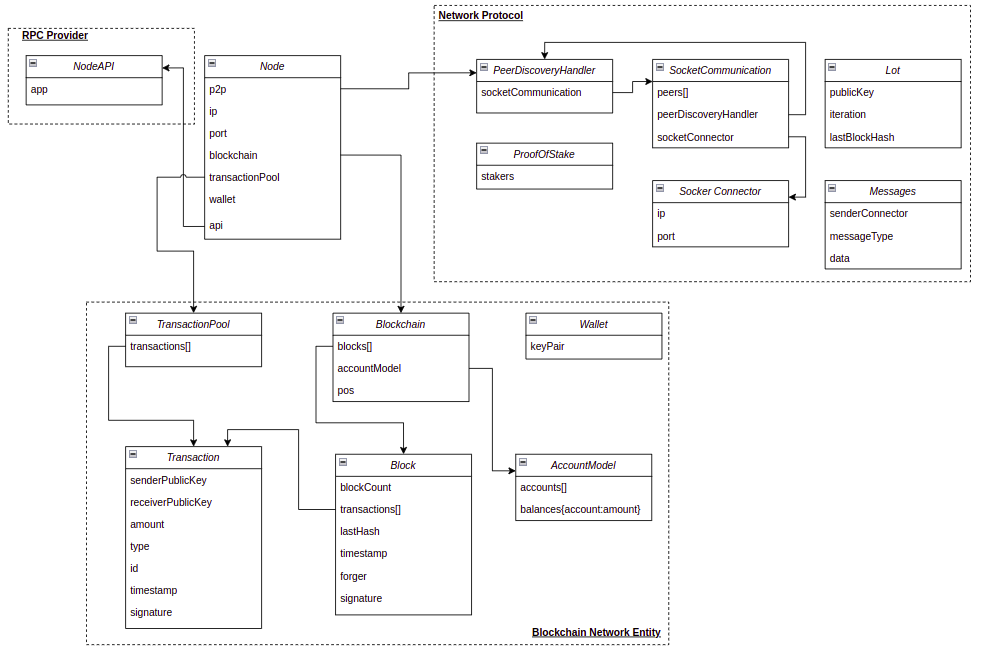

### Overall

Small Project about PoS Blockchain Network using Python.

<!-- GETTING STARTED -->
## ER Diagram


1. Transaction Entity: To store basic transaction information: from address, to address, amount of native token, type of transaction, ...
2. Transaction Pool: To store the list of the waiting transaction so the node validator can check and add to a new block if valid.
3. Block: To store a list of confirmed transactions and then broadcast to all networks.
4. Blockchain: To store the list of blocks starting from the default genesis block.
5. AccountModel: To store the state of the specific block ( including which public key own how many native tokens)
6. Wallet: To store keyPair(object contains publicKey and privateKey)
7. Node: Software to run on a specific machine as a "node validator" and "RPC API".
8. NodeAPI: To run web API to get data from the blockchain and send transactions.
9. PeerDiscoveryHandler: Mechanism to discover and create connection by calling SocketCommunication Entity.
10. SocketCommunication: To listening on incomming request ( node<->node p2p protocol ) and store communication socket.
11. SocketConnector: Object to store IP, Port.
12. Lot: Object to store hash submission inside PoS Protocol.
13. Messages: Object to store the message.
14. ProofOfStake: PoS Protocol.

<!-- USAGE EXAMPLES -->
## Usage

1. Running the initial node with prefix genesisPrivateKey
   ```sh
   python Main.py localhost 10001 5000 keys/genesisPrivateKey.pem
   ```
2. Running the second node ( or as many side node as you want ) without prefix PrivateKey. See the connection between initial node with second node.
   ```sh
   python Main.py localhost 10002 5001
   ```
3. Running the third node ( or as many side node as you want ) without prefix PrivateKey. See the connection between initial node with third node.
   ```sh
   python Main.py localhost 10003 5002
   ```
4. Running the Interaction script to execute example transaction
   ```sh
   python Interaction.py
   ```
5. Running the fourth node ( or as many side node as you want ) without prefix PrivateKey. See the connection between initial node with third node and all the previous transaction being updated ( check through API in port 5000 - localhost:5000/blockchain )
   ```sh
   python Main.py localhost 10003 5002
   ```

<p align="right">(<a href="#top">back to top</a>)</p>

